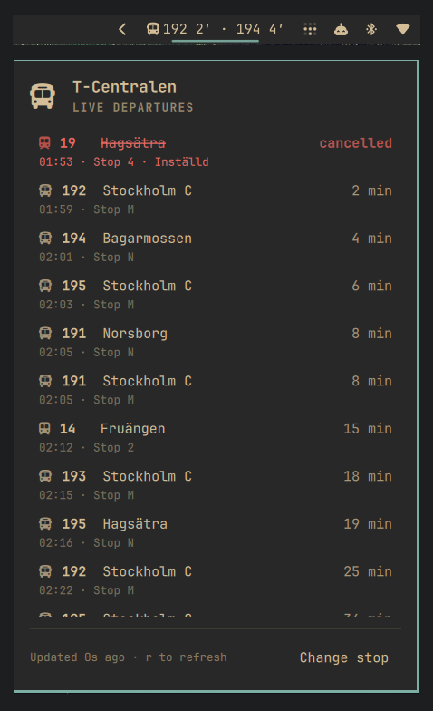

# SL Departures — an Omarchy bar widget

Live departure times for a Stockholm public transport stop, in the Omarchy bar.

```
 18 3′ · 19 7′
```

Click it and you get the full board: line, destination, berth, minutes left,
cancellations, and any service messages for the station — plus a searchable
stop picker, so you never have to look up a stop id by hand.



It reads SL's open [Transport API](https://www.trafiklab.se/api/trafiklab-apis/sl/transport/),
which needs no account and no API key.

## Install

```bash
omarchy plugin add https://github.com/henrrrik/sl-departures-widget.git
omarchy plugin enable io.github.henrrrik.sl-departures --section center
```

`omarchy plugin add` clones into `~/.config/omarchy/plugins/io.github.henrrrik.sl-departures/` —
named after the manifest id, not the repository — so that is the id every
`omarchy plugin` and `omarchy bar` command wants.

Or, from a local checkout:

```bash
git clone https://github.com/henrrrik/sl-departures-widget.git
cd sl-departures-widget
./install
omarchy plugin enable io.github.henrrrik.sl-departures --section center
```

Later updates:

```bash
omarchy plugin update io.github.henrrrik.sl-departures    # installed with `plugin add`
git pull && ./install                  # installed from a checkout
```

Then click the widget and pick your stop. Nothing else is required — the
picker writes the stop into `~/.config/omarchy/shell.json` for you.

### Uninstall

```bash
omarchy plugin remove io.github.henrrrik.sl-departures
```

This disables the widget and deletes `~/.config/omarchy/plugins/io.github.henrrrik.sl-departures/`.
The only other things the plugin ever creates are its own entry in
`~/.config/omarchy/shell.json` (removed by the command above) and the stop-list
cache at `~/.cache/omarchy/sl-sites.json`, which is safe to delete.

### Dependencies

Everything the widget needs ships with a stock Omarchy install: `curl` and
`bash` at runtime, `python3` additionally for the optional `bin/sl-sites`
helper, and `rsync` (with a plain-`cp` fallback) for the local `./install`
script. There are no QML dependencies beyond the Omarchy shell itself.

## Using it

| Action | What it does |
|---|---|
| Left click | Open / close the departure board |
| Right click | Refresh now |
| Middle click | Open the stop picker |
| `r` | Refresh (board open) |
| `s` | Open the stop picker (board open) |
| `j` / `k`, arrows | Scroll the board |
| `Esc` | Close, or leave the picker |

The board refreshes every 30 seconds and counts down every 15, so the minutes
stay honest between fetches. A failed refresh leaves the last board on screen
rather than blanking it.

## Configuration

Settings live inline on the widget's entry in `~/.config/omarchy/shell.json`:

```json
{
  "id": "io.github.henrrrik.sl-departures",
  "siteId": 9192,
  "siteName": "Slussen",
  "transport": "METRO",
  "direction": 1,
  "lines": "13, 14",
  "walkMinutes": 5,
  "barCount": 2,
  "panelCount": 12,
  "forecastMinutes": 90,
  "refreshIntervalSec": 30,
  "barFormat": "{line} {wait}",
  "showIcon": true
}
```

| Key | Default | What it does |
|---|---|---|
| `siteId` | – | The SL site to watch. Set by the picker; `sl-sites <name>` finds it too. |
| `siteName` | – | Display name. On its own (no `siteId`) it is resolved to an id on first run. |
| `transport` | all | `BUS`, `METRO`, `TRAM`, `TRAIN`, `SHIP`, or `FERRY`. |
| `direction` | both | `1` or `2` — SL's direction codes for the stop. |
| `lines` | all | Comma-separated line designations, e.g. `"4, 74"`. |
| `walkMinutes` | `0` | Hides departures leaving sooner than this, so the board only shows what you could still catch. |
| `barCount` | `2` | Departures shown in the bar. |
| `panelCount` | `12` | Departures shown in the popup. |
| `forecastMinutes` | `90` | How far ahead to ask for. |
| `refreshIntervalSec` | `30` | Seconds between fetches (minimum 15). |
| `barFormat` | `{line} {wait}` | Template per departure. Tokens: `{line}` `{wait}` (`4′` / `now`) `{min}` (bare number) `{clock}` `{destination}` `{icon}`. |
| `showIcon` | `true` | Mode icon in front of the bar label. |

The widget allows multiple instances, so a second entry with a different
`siteId` gives you home and work side by side. Instances in the same shell
share one fetch per distinct stop/filter combination, so duplicates cost
nothing extra. Put multiple instances in different bar sections: the shell's
live settings propagation is per-section, and two identically-named widgets in
one section can briefly mirror each other's settings changes until a restart.

### Finding a stop id from the terminal

```bash
bin/sl-sites gullmars              # 9189  Gullmarsplan
bin/sl-sites --departures 9189     # what is leaving right now
bin/sl-sites --refresh             # re-download the stop list
```

The stop list is cached in `~/.cache/omarchy/sl-sites.json` and shared with
the widget, which refreshes it weekly on its own.

## How it works

| File | Role |
|---|---|
| `Model.js` | All parsing, filtering, and formatting. Pure functions, no QML types. |
| `SlHub.qml` | Singleton: the shared fetch loop, clock anchoring, and the site directory. |
| `Service.qml` | Per-instance subscriber: config, filtered rows, name resolution. |
| `Panel.qml` | The bar button and the popup. |
| `bin/sl-sites` | Terminal helper for looking up stop ids. |

### Shared fetching

All widget instances in a shell process — including the copy each monitor's
bar surface mounts — share one `SlHub` singleton. Instances subscribe to their
departures URL; the hub runs a single fetch loop per distinct URL, parses each
payload once, and keeps the parsed departures across failed refreshes so the
board keeps counting down through an outage instead of freezing. The site list
is likewise parsed once per process, only when the picker or a name lookup
actually needs it.

### Clock anchoring

SL returns departure times as naive `Europe/Stockholm` wall-clock strings, so
subtracting the machine's clock is only correct on a machine set to Stockholm.
Instead the widget anchors itself to SL's own clock: a departure that reports
both `"4 min"` and an absolute `expected` time pins down what "now" was when
the server answered. The median across every such departure becomes the offset
applied to `Date.now()`, and it is kept across fetches — so the countdown is
right on a laptop in any timezone, and keeps ticking between fetches.

## Development

The plugin is a plain directory of QML plus a manifest. `./install` mirrors the
checkout into `~/.config/omarchy/plugins/io.github.henrrrik.sl-departures/` and reloads the shell;
it copies everything but the repository's own scaffolding, so a new QML file is
never left behind by a stale file list.

Editing files in the installed copy hot-reloads, but the QML engine can serve a
cached compilation unit for nested components — `omarchy restart shell` is the
reliable way to pick up a change. Installing via a symlink does not work at
all: the shell's file watcher does not follow symlinks.

Two non-obvious pieces of wiring: the `qmldir` declaring the `SlHub` singleton
replaces QML's automatic same-directory type discovery, so every sibling type a
file uses must be listed in it; and the settings defaults live in
`Model.resolveConfig` alone — the manifest's `schema` mirrors them for the
settings UI, but `resolveConfig` is the authority at runtime.

Check the manifest against Omarchy's schema before pushing:

```bash
omarchy plugin validate "$PWD"
```

`Model.js` is deliberately free of QML types so it can be exercised directly:

```bash
sed '1d' Model.js > /tmp/model.js   # drop the .pragma line
node -e 'const M = require("/tmp/model.js"); ...'
```

## License

MIT — see [LICENSE](LICENSE).

Departure data comes from SL via [Trafiklab](https://www.trafiklab.se/); this
project is not affiliated with or endorsed by SL or Region Stockholm.
